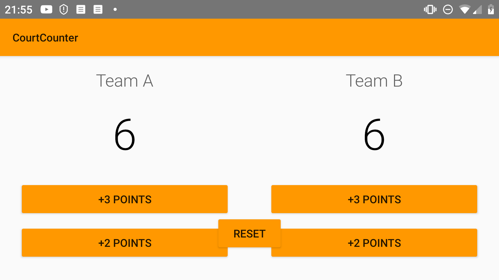

# CourtCounter
This little Single screen app for practice.
3. USER INPUT -> Lesson 4. Making an App Interactive: Practise Set. 

# Update v1: 15/11/2019
Ok,  I have Team A with 3 Buttons now (Score 3, 2 and 1 point). Each time when I press any of these buttons I will increase the Team A score points and show the score under the team name.

# Update v2: 15/11/2019
Ok,  I have Team A and Team B with 3 Buttons now (Score 3, 2 and 1 point). Each time when I press any of these buttons I will increase the right Team  score points and show the score under the team name.

# Update v3: 16/11/2019
Ok,  I have Team A and Team B with 3 Buttons now (Score 3, 2 and 1 point). Each time when I press any of these buttons I will increase the right Team  score points and show the score under the team name. Added some kind of style to my code plus I tried to implement ViewModel to fix a rotate bug.

# Update v4: 22/04/2020
Ok, I tried to use ViewModel to fix the landscape bug(Bug: The points are incorrect after phone rotation.) I followed this  [article:](https://medium.com/androiddevelopers/viewmodels-a-simple-example-ed5ac416317e)
There is a bug when rotate the phone... The "reset" button is not in the right position.
 Solution could be:
- doesn't allow to rotate.
- change the layout.

Here is a screenshot about the bug:

